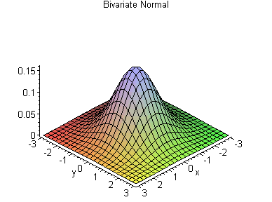
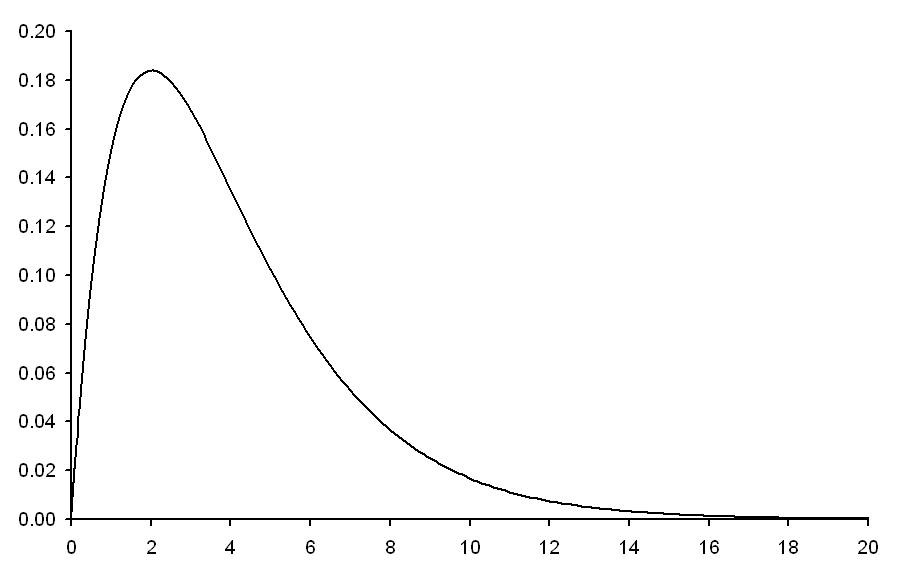
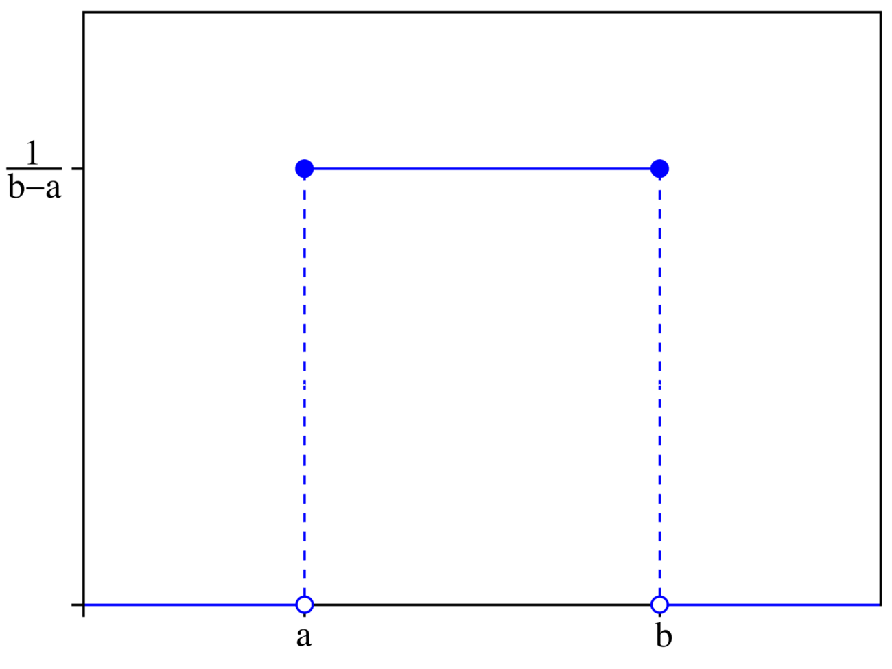
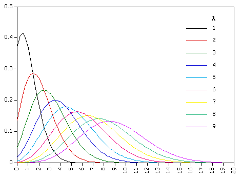

#  Visualizing Bayesian Results
Week 8 | Lesson 5.1

### LEARNING OBJECTIVES
*After this lesson, you will be able to:*

- Understand how to interpret distribution graphs to collate them to various hypothesis
- Plot Priors and Posteriors
- Know how to express Bayesian analysis in a context of a logical analysis with a well-formed hypothesis and a well formed consequence

### STUDENT PRE-WORK
*Before this lesson, you should already be able to:*

- Explain/Conceptualize basic Bayesian statistical analysis
- Do basic graphical visualizations
- Understand the nuts/bolts of hypothesis testing

### INSTRUCTOR PREP
*Before this lesson, instructors will need to:*
- Gather materials needed for class
- Read through datasets and starter/solution code
- Add to the "Additional Resources" section for this lesson

### LESSON GUIDE
| TIMING  | TYPE  | TOPIC  |
|:-:|---|---|
| 5 min  | [Opening](#opening)  | Communication starts with the statistical test  |
| 10 min  | [Introduction](#introduction)   | Getting the verbal game down  |
| 15 min  | [Demo](#demo)  | Eye-balling distributions  |
| 25 min  | [Guided Practice](#guided-practice<a name="opening"></a>)  | Visualizing that Posterior  |
| 25 min  | [Independent Practice](#ind-practice)  | Visualizing PyMC  |
| 5 min  | [Conclusion](#conclusion)  | Conclusion  |

---

<a name="opening"></a>
## Communication starts with the statistical test (5 mins)

Bayesian analysis can be very esoteric and mathematical, but often times communicating the results of a Bayesian statistical test or explaining a Bayesian regression model may be far simpler than their classical counterparts. Why? It's because paradigm fundamentally builds on a very common-sense notion: If we have some prior information, we can use that information somehow to inform our opinions about the future. In a way, the Bayesian paradigm is intrinsically causal, and thus, much easier for human beings, which live in a world that seems causal (at least above the Quantum level!)

When building Bayesian models, you should avoid the mathematical elements, and focus on displaying distribution charts, likewise, if you are building a Bayesian model, don't write down the regression equation, instead display the Bayesian dependency chart, something you've already done at least once this week.

We'll go over these, as well as some good rules-of-thumb with respect to explaining statistical tests/results made through the Bayesian lens. Hopefully, these will help round out your learning this week and set you on firmer footing with respect to using the basic Bayesian apparatus, but also developing that skill-set further in the future!


<a name="introduction"></a>
## Introduction: Getting the verbal game down (10 mins)

These are probably good principles to have both within and outside the Bayesian framework. However, before any visualizations are introduced, you should be able to explain clearly and accurately, what your analysis is arriving at. Here are a couple of rules of thumbs:

- Do not confuse statistical significance with practical significance. This is the one that gets a lot of frosh data scientists. Just because something is statistically significant, DOES NOT MEAN the practical effects you are detecting are large.
- Following from the above, never EVER use the word "significant" in isolation. Normal people will just assume significant means observable effect size. This is dangerous, and many an analyst have fallen for this trap only to find their executive moving forward with a move, they really shouldn't be... and I'll tell you that the negative practical effect size that occurs to that analyst a few weeks/months down the line isn't pretty...
- Always start your analysis by describing your data, in fact don't just talk about your data, discuss at length how the data was collected, provide ANY factors that may mitigate the data's veracity, and assume all/any aggregation/summarization/transformations you may have imposed on the raw data
- Confidence Intervals > P-Values (almost always)
- Always setup a baseline to measure against. Saying something is X.X% doesn't mean anything. First, you have to report what the baseline you're building your percentage from is, why you choose that baseline, and how that baseline is practically relevant to your study. If you're finding it difficult to setup a baseline, then appeal to standardized baselines. You don't want to become a statistical automata spouting off .05% levels and "2 standard deviations" from whatever. We have computer programs for that sort of analysis
- Lead with your observed practical effects, in fact, it may be best to report them all, whether or not they are significant in a statistical way or not
- Avoid outputting an ANOVA table or any other tabular array of numbers if possible. Unless you're talking to other data scientist, no one will know what you're showing them anyways, especially in the United States, where the average numeracy of the population is quite low
- When visualizing Bayesian results, draw direct graphs/dependency charts (more on that below) to explain how the various model components impact each other

This is just a small list, but I'm sure you can add to it. In fact, why don't you spend the next few minutes discussing this with an immediate neighbor and perhaps come up with additional items to put on your list!

<a name="demo"></a>
## Demo: Eye-balling distributions (15 mins)

A good deal of Bayesian statistics has to do with specifying prior distributions and assessing the impact prior distributions may have to posteriors. However, to do this, we need to first be able to know how the various distributions look like from a 2-dimensional graph. It is unlikely you will use more than 2 dimensions, sometimes people do visualize distributions using 3 dimensions, the oft-used example being the multivariate normal distribution:



However, it's not very common when presenting to clients or doing ad-hoc analysis. You should develop good facility with the shape of distributions and how to intuit what your distribution your particular data set may be drawn from. As an example, here are the most popular:

Chi Square Distribution:



Uniform Distribution:



Poisson Distribution:



There are of course, more, let's move forward into some coding to see how we can actually produce some interesting plots to communicate Bayesian results.


<a name="guided-practice"></a>
## Guided Practice: Visualizing that Posterior (get your mind out of the gutter) (25 mins)

We know that the posterior distribution is made up of priors and likelihoods. We've analyzed it mathematically, we've optimized with it to estimate parameters, but we haven't done much in terms of visualization. That will change now.

For the graphical output you may need to reference the following if you are not familiar already with the methods :
http://matplotlib.org/examples/pylab_examples/subplots_demo.html

```python
# Stub
import numpy as np
import matplotlib.pyplot as plt
import seaborn as sns
import scipy.stats as st


x_value = np.linspace(0, 1, 100)
sample = np.random.binomial(n=1, p = .8, size=100)
# Stub ends here
# Solutions Starts:

likelihood = np.array([np.product(st.bernoulli.pmf(sample, p)) for p in x_value])
prior_sample = np.random.binomial(n=1, p=.5, size=100)
prior = np.array([np.product(st.bernoulli.pmf(prior_sample, p)) for p in x_value])
prior = prior / np.sum(prior)
posterior = [prior[i] * likelihood[i] for i in range(prior.shape[0])]
posterior = posterior / np.sum(posterior)

#Graph element starts here
fig, ax = plt.subplots(3, 1, sharex=True, figsize=(8,8))
ax[0].plot(x_value, likelihood)
ax[0].set_title("Sampling Distribution")
ax[1].plot(x_value, prior)
ax[1].set_title("Prior Distribution")
ax[2].plot(x_value, posterior)
ax[2].set_title("Posterior Distribution")
sns.despine()
plt.tight_layout()
plt.show()

```


<a name="ind-practice"></a>
## Independent Practice: Visualizing PyMC results (25 minutes)

> Instructor Note: [This is a generic model, but can be found here](http://jakevdp.github.io/blog/2014/06/14/frequentism-and-bayesianism-4-bayesian-in-python/)

We've been exposed to a lot of technology this week. The most prominent has been PyMC. Study this model, understand how it works. Then complete it by deploying the MCMC. From there, get in teams of 3 - 4 and think of ways to visualize the model and/or data/results. Recall what we talked about in terms of getting the verbals right, the good rules of thumbs with respect to talking about and visualizing a model, and maybe come up with some decent hypothesis. Once you're done within your cluster, present your explanations to the rest of the class.


```python
# Define the variables needed for the routine, with their prior distributions
alpha = pymc.Uniform('alpha', -100, 100)

@pymc.stochastic(observed=False)
def beta(value=0):
    return -1.5 * np.log(1 + value ** 2)

@pymc.stochastic(observed=False)
def sigma(value=1):
    return -np.log(abs(value))

# Define the form of the model and likelihood
@pymc.deterministic
def y_model(x=xdata, alpha=alpha, beta=beta):
    return alpha + beta * x

y = pymc.Normal('y', mu=y_model, tau=1. / sigma ** 2, observed=True, value=ydata)

# package the full model in a dictionary
model1 = dict(alpha=alpha, beta=beta, sigma=sigma,
              y_model=y_model, y=y)

```


<a name="conclusion"></a>
## Conclusion (5 mins)

You've spent an entire week learning about the concepts, mathematics, and technology behind Bayesian analysis. This lesson has capped your knowledge by providing strategies to communicate your knowledge to the greater world. Hopefully you'll take this learning and build off of it in your career, and perhaps become an innovator in the field one day. Good luck, and happy coding !

***

### ADDITIONAL RESOURCES
- [The next level after PyMC... PyMC3! Check it out here](https://pymc-devs.github.io/pymc3/)
