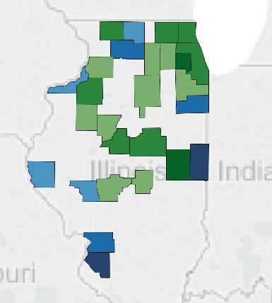
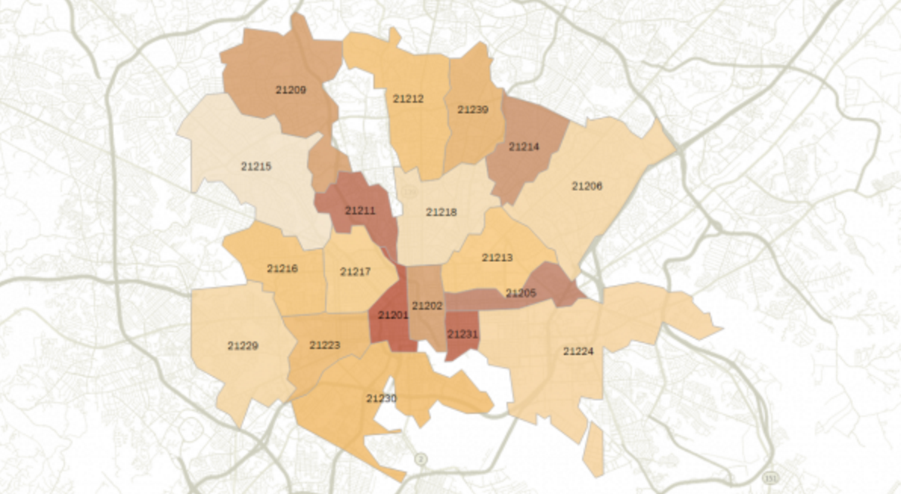
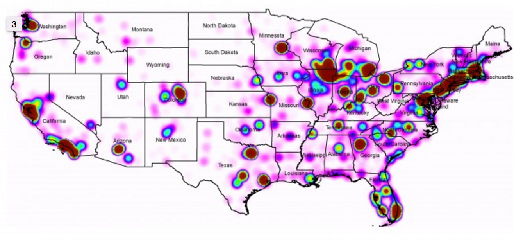

#  Visualizing Time Series & Geographic Data

## Introduction

> ***Note:*** _This can be a pair programming activity or done independently._

_Back at the CDC..._

Become familiar with the data describing the West Nile Virus situation in Chicago. We would like for you to bring your new teammates up to speed by preparing a brief info-session.

- [CDC Statistics & Maps | West Nile Virus](http://www.cdc.gov/westnile/statsmaps/)
- Get the data from [West Nile Virus Prediction Kaggle Contest](https://www.kaggle.com/c/predict-west-nile-virus/)

The main goal here is to describe, in detail, what is shown in the data. We expect you to do this by creating a presentation of visualizations of the available data. Using Tableau, create images that will tell the story of the spread of the disease and the learnings we've gained from our testing and spraying data. 

## Check Knowledge: 

Question: How does this differ from time series data visualization and analysis in pandas?

## Exercise

Using Tableau's various different graphing utilities, prepare visual data insights to describe your findings in the data. This exercise should also uncover more details that mutating the data in Pandas does not.

This exercise is an extension of the EDA process. When deciding methodologies for data cleaning and organization, it is best to make those decisions using visual representations of the data for reference. 

Guide Pratice in Tableau:

1. Adding background map images from openstreets maps, [tutorial link](http://kb.tableau.com/articles/knowledgebase/mapping-datapoints-google-maps)
- set "geographic role" by right clicking data that is not automatically identified & setting as "dimension"
- Tableau uses the same projection as Google Maps
- background maps can be any other image, i.e. dental charts
- Latitude (up and down from the equator); Longitude (distance east or west from prime meridian)
2. Map Layers - turn on borders and details
3. Time & Data 
- Implicit understanding of date hierachy 
- Compare cycle plots, by years, and by months
- Bar Char expansion and comparison
- Table calculations: percent differences, moving averages, and running totals

Questions to get started:

1. For location based data, Heatmaps are the standard. How can we use Heatmaps to tell a story that changes over time? **BONUS:** Overlay the Heatmap over a map of the area.
1. To track differences over time, try putting your data into a Frequency Chart.
1. Overlaying different cuts of data can help show the repeatability or difference in trends.
1. In Data Viz, readability is everything! Be sure to spend extra time 'prettifying' your graphs, and ensuring that the color choices are consistent and legible.

#### Requirements

- Choose at least three different 'stories' you would like to tell about your data. Use enough graphs as necessary to thoroughly display the analyses you've done.
- Assemble a slide deck or PDF presentation aimed at explaining the dataset to your coworkers.
- Use Tableau to create professional looking visualizations.

**TIP:** Check out the resource links below, they may come in handy.

#### Starter code

You should already have code from the previous Kaggle lab to get you started. Using your EDA notes, you should be able to jump right in and extract meaningful graphs from the data.

#### Deliverable

> Instructor's Note: If possible, keep time at the end to allow students to present their visualizations. If there isn't enough time, pick the student(s) with the best results and let them present to the class. Have a discussion on the pros and cons of their approach.

> For evaluation, you should be looking at Heatmaps that properly display data density with clear labels. It is preferable that the students submit multiple heatmaps over time to demonstrate how data changes as a function of time. You should also be looking for complex relationships, i.e. mosquito count plotted against average temperature, or plots displaying data sparsity at each location. It's best to focus on breadth rapther than depth, make sure that the students are exploring all the data rather than zooming in on one specific feature.

Your presentation should be submitted via Github PR. **NOTE:** Be sure to include all relevant Tableau files!

Here are some examples of Tableau heatmaps. You can make yours as robust as you'd like, but at a minimum, it should feature general labeling for locations, and some form of visual representation of data density per area. Some useful tutorials are linked below.

## **BONUS**

- Provide geographical overlay heatmaps in Matplotlib and Seaborn as well as Tableau.

## Additional Resources

- [Tableau Time Series Analysis](www.tableau.com/stories/topic/time-series-analysis)
- [Time Series & Time Pattern Displays In Tableau](https://canvas.uw.edu/courses/891359/assignments/2378170?module_item_id=5158795)
- [Geographic Roles in Tableau](http://onlinehelp.tableau.com/current/pro/online/windows/en-us/help.htm#maps_geographicroles.html)
- [Heatmaps in Tableau](http://ksrowell.com/blog-visualizing-data/2013/04/10/how-to-create-a-geographical-heat-map/)
